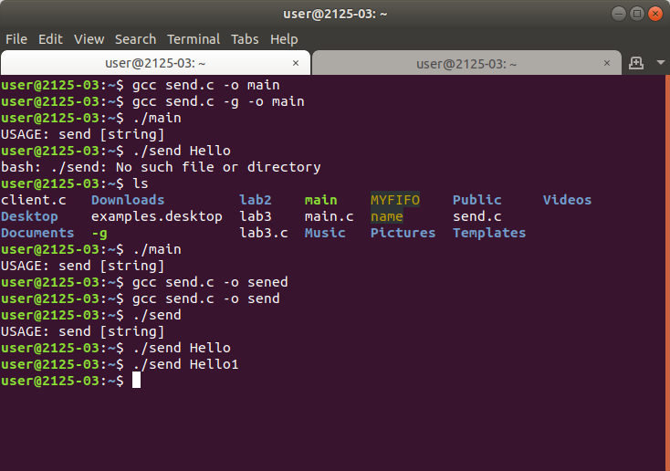

# Lab4
##Робота з поіменованими каналами. Реалізація технології "клієнт-сервер"
###Мета
####Розібрати програми роботи з іменованими каналами, привести приклад реалізування технології "клієнт-сервер", ознайомити з оперативним та фоновим режимами роботи.

